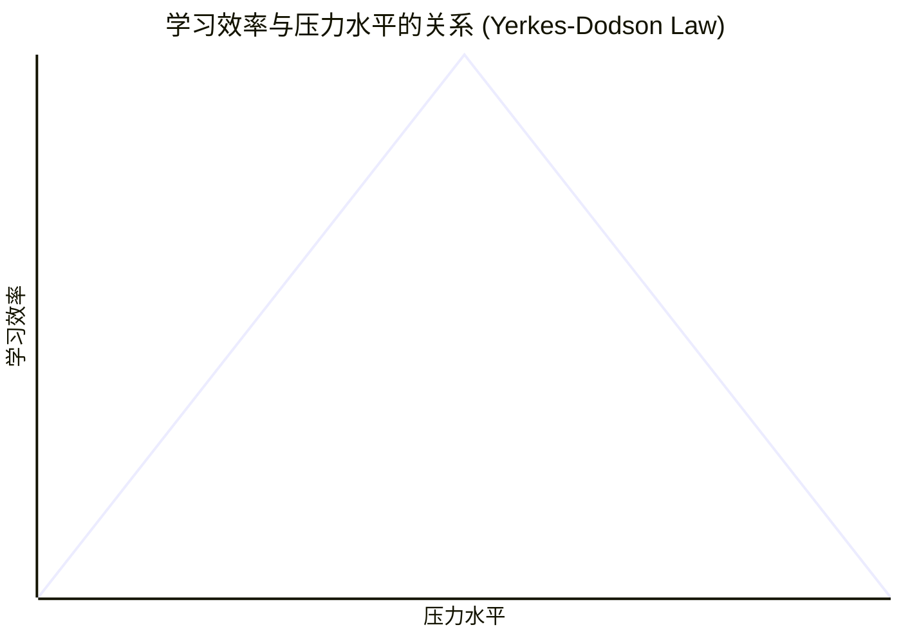

# 文本 + 演讲

听与读同时进行本质上与“双听”(dichotic listeing) 相同，会产生布罗卡/韦尼克瓶颈

大脑理解口头语言的三个区域
- 听皮质 (auditory cortex)
- 罗卡区/韦尼区，负责理解
- 左侧额下回 (left inferior frontal gyrus)，会从多个声音信号中选择一个进入布罗卡区/韦尼克区

启示
- PPT 上少放文字，放关键字
- 浅记速度快，但深度浅；深记速度慢，但印象深。纸笔适合深记，选择重点记、

# 图像 + 演讲

图像与听觉不会产生冲突，并且会相互配合
- 并非简单加和，而是 A+B=C

启示
- PPT 上放图片，注意图表与图片不同，图表不容易理解
- 权衡图片相关性，先用无关内容吸引注意，再用深度相关图片加深理解

# 位置

脑力运动者记忆使用轨迹记忆法（method of loci）  
电影拍摄中越轴（cross the line）让观众出戏

可预测布局释放大脑资源
- 海马体充满位置细胞，将空间布局嵌入新记忆

应用
- PPT 格式一致减少注意力分散
- 打破一致性吸引注意力

# 情景/状态

海马旁回将位置信息嵌入新记忆

- 情景依赖学习
- 状态依赖学习  
学习的场景（外部）与状态（内部）会影响学习效果

- 情景记忆
- 语义记忆  
通过多场景学习将情景记忆 -> 语义记忆

启示
- 一次实战，保持训练环境与实战环境一致
- 实战环境多样，或者想获得脱离环境的能力，改变实战环境
- 利用感官加深/调取记忆
- 利用情景依赖让他人识别信息

# 多任务处理

注意力是一个过滤器
- 侧前额皮质（lateral prefrontal cortex, LatPFC）根据背侧注意网络（dorsal attention network）的阅读规则集过滤掉无关信息
- 腹侧注意网络（ventral attention network）在背后监控无关信息
- 司机与教练

任务切换的代价
- 时间，注意瞬脱（attention blink）
- 准确性，心理不应期，规则集混合，整体表现下降
- 记忆，海马体活跃度下降，纹状体增加（习惯性动作）

启示
- 学习的时候避免干扰，不要一心多用
	- 走路吃饭是一种习惯性动作，是自动的，但也会和规则集混合造成混乱
	- 门口效应（doorway effect），腹侧注意网络将未经过海马的信息抹去，记忆抹除
- 复杂任务分解
- 学习时减少电子产品
- 演讲时避免话说一半或提前引发思考
- 讨论时一次一个想法

# 交错

基地神经节（basal ganglia），前辅助运动皮层（pre-SMA），前额皮质
- 基底神经节的动作信号是无序的
- pre-SMA 完成排序工作
- 送到前额皮质执行
- 调酒师与服务生

组块 chunking
- 减少占用资源
- 太牢固
	- 电话号码后几位
	- 罚球

使用交错避免形成意外模块
- 好处
	- 避免小模块组成大模块
	- 更快调取单个模块
	- 促进迁移（transfer）
- 注意
	- 信心支持
	- 只有实战不可预测才有效
	- 不同模块切换（快慢球不是交错）

启示
- 在技巧逐渐自动化过程中引入交错
- 迁移需要相似模块交错
- 在技能内部可以练习，在技能之间交错
- 大脑训练游戏不会提升记忆力，只是组块能力增强，反而影响迁移到现实中，
- 模块可以打破，但要大量单个动作练习

# 错误 

错误提醒我们现实与预测存在差距，说明心理模型（mind model）需要更新
- 前扣带回皮质发出错误正波，腹侧注意网络兴奋，身体专注起来

对待错误的方式
- 专注于错误，大脑产生θ波
- 忽视错误，大脑产生β波，阻碍学习，屏蔽错误，坚持自己的预测
- 原因：个人化（personalization）
	- 将错误解读为对自己的威胁，不敢犯错，自我设限

从错误中学习四阶段
- 意识到错误
- 分类发现底层原因
- 纠正错误
- 自主分析

好奇心产生于寻找解决方案的过程，一旦得到答案，好奇就消失了
- 赛车手的兴奋在赛道上

启示
- 注重错误的文化，避免错误个人化
	- 过程导向，将错误透明并一起探讨、分类
- 把错误融入学习过程，加深印象
	- 演讲时提出普遍误区
	- 矫枉过正（hypercorrection）现象：人们更倾向于修正觉得有信心不会错的错误
- 先明确错误类别
- 刻意练习错误分析能力

# 记忆

记忆是一整个乐团，调取记忆需要重奏整个乐团，对应的指挥是右前额皮质的一小块脑区

记忆三步走
- 编码（进入大脑）
- 存储（留存在大脑中）
- 调取
	- 回顾（外部）
	- 识别（外部与内部结合）
		- 外部乐章与内部乐章比对
	- 回忆（内部）
		- 联想（association）来收集足够多的“伴奏”，下次回忆时会想起所有关联网络串联起的伴奏

调取是形成深刻持久记忆的关键，而回忆是调取方式中印象最深的

启示
- 教学中融入回忆
	- 自由回忆与提示回忆，提示回忆让记忆更准确，自由回忆更持久
- 卡片回忆
	- 不要去掉正确的卡片
- （利用高亮）立即回顾 -> 回忆

# 先入为主

记忆的关联被激活后不会立刻消失  
先入为主（priming）的分类
- 概念先入为主激活事实，引导理解
- 预期先入为主激活预期，引导感知与反应
- 策略先入为主激活流程，引导行为

应用
- 充分利用第一印象
	- 打破第一印象需要更强烈的相反情绪
- 演示认知策略
	- 意识到先入为主，就可以避免其影响
	- 如果 - 那么
- 引导，思考同一件事；发散，避免先入为主
- 盲审

# 故事

故事三要素
- 物理刺激，有因果关系的一系列行动
- 心里刺激，动机与意义
- 观众

联想网络围绕记忆地标建立，而故事是理想的地标
- 大脑在一直产生事物的联系，而故事在模仿大脑的天然工作方式
- 心理与情感上的模拟
- 催产素，增加观众的投入

# 压力

适度压力才能促进学习

情绪（emotion）与感受（feeling）
- 情绪是身体感受（physical sensation）
	- 6 种基础情绪：喜悦、恐惧、愤怒、惊讶、悲伤、厌恶
- 感受是心理解释（psychological interpretation）

压力是一种感受，觉得有压力是心理层面进行了解释

压力的故事
- 角色
	- 海马、杏仁核、皮质醇、去甲肾上腺素、ARC 蛋白、FGF2
	- 森林的比喻
- 短暂的压力，神经元增多
- 持续的压力，神经元被皮质醇杀死
- 零压力，神经元因为自然退化而死亡

启示
- 利用情绪变化提高记忆
- 频繁短暂的中度压力
	- 新鲜感让大脑活跃
- 多样化避免情绪状态依赖
- 减压技巧
	- 深呼吸
	- 渐进式肌肉放松法（progressive muscle relaxation）：先紧张几秒再放松
	- 大脑空白：深蹲，握拳

# 分散

艾宾浩斯遗忘曲线

长时间多次调取比短时间更有效
- 多样性
- 调取
- 巩固（consolidation）
	- 夜晚大脑重演，将记忆巩固

经验法则
- 根据截止时间设定复习时间
- 如果没有截止时间，逐渐延长复习间隔

练习必须是实打实的

启示
- 分散训练
	- 刷剧印象不深
	- 分散学习
- 不要把复习留到最后
- 无需完全掌握就可以开始复习

